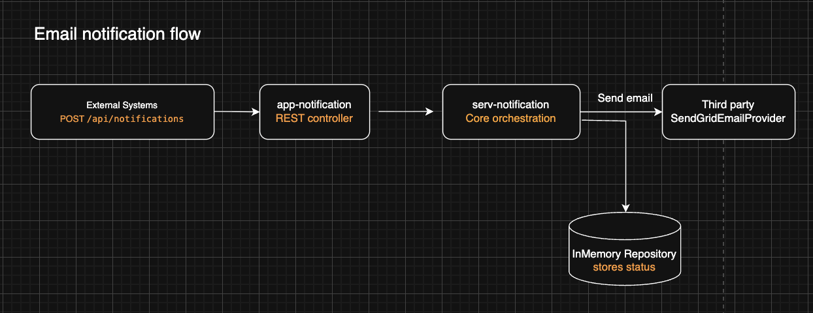
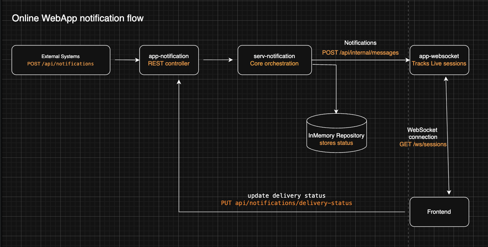
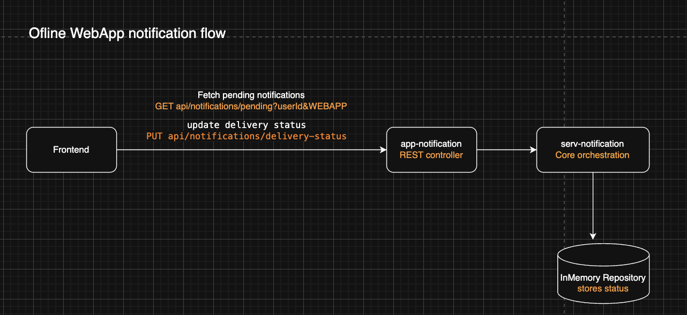

# Notification Platform

A multi-module Spring Boot application for creating, delivering, and tracking notifications across email and web app channels. The platform separates notification orchestration (`app-notification`), core business logic (`serv-notification`), and real-time WebSocket delivery (`app-websockets`).

## Tech stack

- Java 25
- Spring Boot 4.1
- Maven (multi-module)
- OpenAPI Generator + springdoc (Swagger UI)
- In-memory persistence (repository interfaces are ready for a real database)

## End-to-end flows

### Email notification flow



### Online web app notification flow



### Offline web app notification flow (reconnect)



## Modules

```
notification/                  Parent POM
├── serv-notification/         Core service library (no HTTP server)
├── app-notification/          Notification HTTP API (Spring Boot app)
└── app-websockets/            WebSocket server (Spring Boot app)
```

| Module | Type | Purpose |
|--------|------|---------|
| `serv-notification` | Library | Domain models, persistence, delivery adaptors, business logic |
| `app-notification` | Runnable app | Public REST API for creating notifications and frontend delivery status |
| `app-websockets` | Runnable app | WebSocket connections and internal message push API |

---

## serv-notification

Core notification service packaged as a **library**. It has no `@SpringBootApplication` and is pulled in as a dependency by `app-notification`. All beans under `com.bloomreach.notification` are component-scanned when the app starts.

### Responsibilities

- **Notification lifecycle** — validate, persist, and route notifications to the correct delivery channel
- **Persistence** — `NotificationRepository` with an in-memory implementation (`ConcurrentHashMap`)
- **Per-user delivery status** — tracks `SENT`, `DELIVERED`, and `READ` for each notification + user pair
- **Channel delivery** — pluggable adaptors for email and web app

### Key packages

```
com.bloomreach.notification.service/
├── NotificationService / NotificationServiceImpl
├── model/                          Notification, NotificationEntity, DeliveryStatus, ...
├── repository/                     NotificationRepository, InMemoryNotificationRepository
└── delivery/
    ├── NotificationDeliveryAdaptorRegistry
    ├── email/
    │   ├── EmailNotificationDeliveryAdaptor
    │   └── SendGridEmailProvider        (logs SendGrid payload; no live HTTP call yet)
    └── webapp/
        ├── WebAppNotificationDeliveryAdaptor
        └── RestWebSocketMessageClient   (calls app-websockets internal API)
```

### Delivery adaptors

| Channel | Adaptor | Behaviour |
|---------|---------|-----------|
| `EMAIL` | `EmailNotificationDeliveryAdaptor` | Maps user ids to `{userId}@notifications.local`, sends via `EmailProvider`. Status stays at `SENT`. |
| `WEBAPP` | `WebAppNotificationDeliveryAdaptor` | POSTs JSON payload to `app-websockets` for each recipient user id. |

### Delivery status

When a notification is created, each user in the audience gets a `SENT` record. For web app notifications the frontend can later report:

- `DELIVERED` — message received by the client
- `READ` — user opened/read the notification

Status only moves forward (`SENT → DELIVERED → READ`). Once `READ`, it is never downgraded, even if a late `DELIVERED` update arrives.

---

## app-notification

The main **HTTP API** for the notification platform. Hosts the public-facing REST endpoints and delegates all business logic to `serv-notification`.

### Entry point

`com.bloomreach.notification.NotificationApplication`

### API contract

Defined in `src/main/resources/openapi/notification-api.yaml` and generated into `com.bloomreach.notification.generated.*` at build time.

| Method | Path | Purpose |
|--------|------|---------|
| `POST` | `/api/notifications` | Create a notification (returns `202` with notification id) |
| `PUT` | `/api/notifications/{notificationId}/delivery-status` | Frontend reports `DELIVERED` or `READ` |
| `GET` | `/api/notifications/pending?userId=&notificationType=WEBAPP` | Fetch undelivered web app notifications on reconnect |

Swagger UI: `http://localhost:8080/swagger-ui.html`

### Configuration

```properties
spring.application.name=notification
websockets.service.base-url=http://localhost:8081
```

`websockets.service.base-url` points to the running `app-websockets` instance.

### Notification types

| Type | Payload | Delivery |
|------|---------|----------|
| `EMAIL` | `emailPayload.subject`, `emailPayload.body` | SendGrid (stub/log only) |
| `WEBAPP` | `webappPayload.title`, `description`, `action` | Real-time via `app-websockets` |

---

## app-websockets

A **separate server** dedicated to maintaining WebSocket connections with frontend clients and pushing messages to them. Other backend services never talk to browsers directly — they call this module's internal REST API.

### Entry point

`com.bloomreach.websockets.WebSocketsApplication`

### Two interfaces

#### 1. WebSocket session (frontend)

| | |
|---|---|
| Endpoint | `GET /ws/sessions` (HTTP upgrade) |
| Auth | `X-User-Id` request header |
| Connection ID | UUID assigned at handshake |

Each user can have multiple concurrent sessions (e.g. multiple browser tabs). Sessions are tracked in `WebSocketSessionRegistry`.

#### 2. Internal message API (backend)

| | |
|---|---|
| Endpoint | `POST /api/internal/messages` |
| Caller | `serv-notification` → `RestWebSocketMessageClient` |

**Request:**
```json
{
  "userId": "user-1",
  "payload": {
    "notificationId": "11111111-1111-1111-1111-111111111111",
    "title": "Scheduled maintenance",
    "description": "The system will be unavailable tonight.",
    "action": "View details"
  }
}
```

**Response:**
```json
{
  "userId": "user-1",
  "connected": true,
  "deliveredConnectionCount": 1,
  "connectionIds": ["7f3c2a1b-4d5e-6f70-8192-a3b4c5d6e7f8"]
}
```

If the user is offline (`connected: false`), no message is delivered over the socket.

### API contract

Defined in `src/main/resources/openapi/websockets-api.yaml`, generated into `com.bloomreach.websockets.generated.*`.

### Key components

| Class | Role |
|-------|------|
| `WebSocketConfig` | Registers `/ws/sessions` |
| `WebSocketAuthenticationHandshakeInterceptor` | Reads and validates `X-User-Id` |
| `WebSocketSessionHandler` | Registers/unregisters sessions on connect/disconnect |
| `WebSocketSessionRegistry` | Thread-safe in-memory session index by user id |
| `WebSocketMessageServiceImpl` | Serializes and sends JSON to open sessions |
| `InternalMessagesController` | Implements generated internal messages API |

---

## Building and running

Requires **Java 25** (see `.java-version`).

### Build everything

```bash
./mvnw clean install
```

### Build a single module

```bash
./mvnw clean compile -pl app-websockets
./mvnw clean compile -pl app-notification
```

OpenAPI sources are generated during `generate-sources`. If your IDE cannot find generated classes, run:

```bash
./mvnw clean generate-sources -pl app-websockets
```

Then reload the Maven project in your IDE.

### Run the services

Start both runnable apps (use different ports):

```bash
# Terminal 1 — WebSocket server (default port 8080; use 8081 to match config)
./mvnw spring-boot:run -pl app-websockets -Dspring-boot.run.arguments=--server.port=8081

# Terminal 2 — Notification API
./mvnw spring-boot:run -pl app-notification
```

---

## Project conventions

- **OpenAPI-first** — REST contracts live in `src/main/resources/openapi/*.yaml`; controllers implement generated interfaces
- **Adaptor pattern** — new delivery channels implement `NotificationDeliveryAdaptor` and register automatically via Spring
- **Package naming** — `com.bloomreach.notification.*` for the notification platform; `com.bloomreach.websockets.*` for the WebSocket service
- **Persistence** — in-memory for now; swap `InMemoryNotificationRepository` for a database-backed implementation without changing the service layer

---

## Current limitations

- In-memory storage (data lost on restart)
- Email delivery logs SendGrid payloads but does not send HTTP requests yet
- No webhook integration for email delivery confirmation
- WebSocket auth uses `X-User-Id` header only (no token validation)
- Pending notifications API supports `WEBAPP` type only
- `audience.groups` and `audience.labels` are stored but not used for targeting
